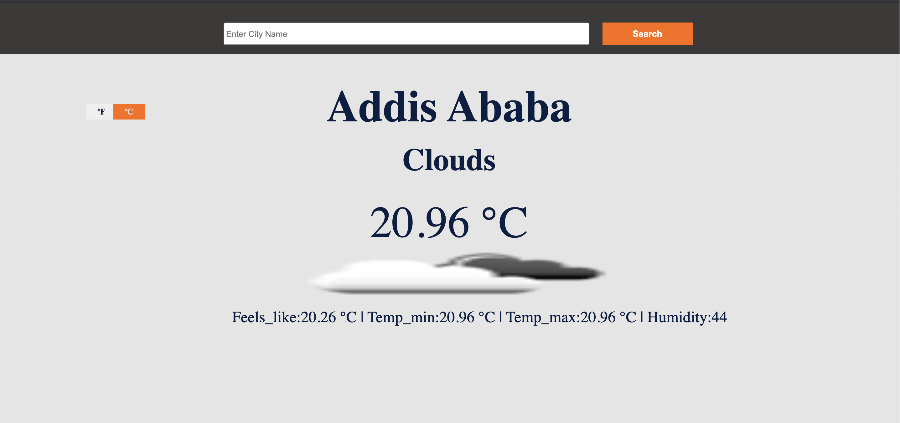

# Weather App

> Weather app is a desktop-only app where user can search and get the current weather condition of any city. Is built by fetching data from weather map.

## Built With

- Javascript
- HTML
- CSS3
- Webpack

## Live Demo

[Live Demo Link](https://deploy-preview-1--amazing-bartik-648d08.netlify.app/)

## Getting Started

To set up a local copy of the project

- `git clone git@github.com:Addis0943/Weather-App.git`
- `cd Weather-App`

If you want to repack the file

- Run `npm install` on the terminal to install dependancies
- Run `npx webpack` to bundle the files in the src folder & product ouput in dist folder

  or

- Go to the dist folder and open index.html

## Author

👤 **Bruk Teshome**

- GitHub: [@githubhandle](https://github.com/bruk19)
- Twitter: [@twitterhandle](https://twitter.com/Bruktesh)
- LinkedIn: [LinkedIn](https://linkedin.com/in/bruk-teshome-ab4325226)

## 🤝 Contributing

Contributions, issues, and feature requests are welcome!

Feel free to check the [issues page](../../issues/).

## Show your support

Give a ⭐️ if you like this project!

## Acknowledgments

- Hat tip to anyone whose code was used
- Inspiration
- etc

## 📝 License

This project is [MIT](./MIT.md) licensed.
